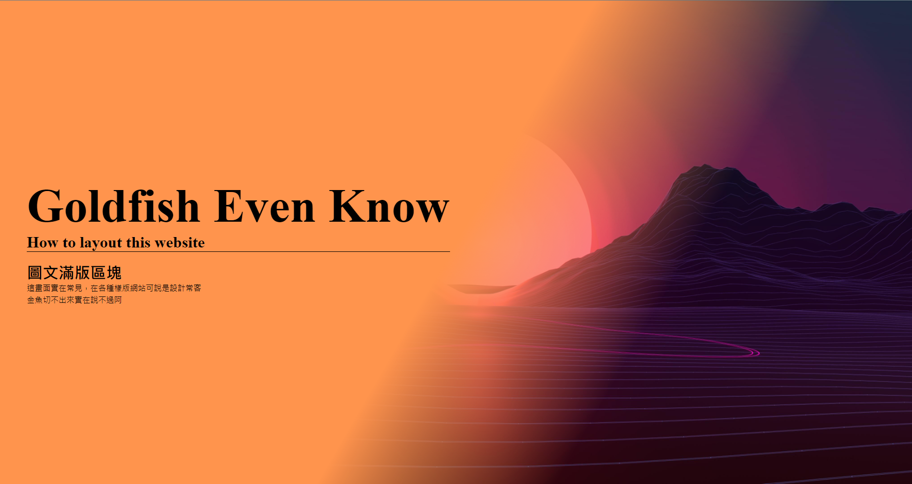

# 金魚都能懂的網頁切版教學

3/3 學習 [金魚都能懂的網頁切版教學](https://www.youtube.com/playlist?list=PLqivELodHt3hxeuLX8PYaI8u1GcDaBoJo) 之程式碼, DEMO 及學習小紀錄

感謝 CSScoke Amos 的教學!

# 30 Days - DEMO & Knowledges I Learned

#### Day1 圖文滿版區塊
  
- linear-gradient()
  ```
   background: linear-gradient(120deg, #7bf 50%, transparent 70%) center center /
      100% 100%,
    url("../img.JPG") right center / auto 100%;
    ```
- DEMO
  

#### Day2 互動圖文卡片

- 子層 absolute position 不代表父層要 relative postion
- 習慣父層被摸到，子層做事情。
- DEMO
  
#### Day3 人員介紹卡片

- 使用定位之後，元素會自動轉型成 block
- [Drawing a triangle with CSS](https://alvaromontoro.com/blog/67970/drawing-a-triangle-with-css)
- 小工具 [CSS triangle generator](http://apps.eky.hk/css-triangle-generator/)
- DEMO
  

#### Day4 交錯漂浮版

- vertical-align
- [hex-rgba-converter](https://marketplace.visualstudio.com/items?itemName=medzhidov.)
- DEMO  
  

#### Day5 超通用橫式版面

- DEMO
  

#### Day6 網頁頁尾版塊

- input selector
  ```css
    input[type="text"],
    input [type="submit"] {
      border: none;
      padding: 5px 10px;
    }
  ```
- 滿版
  ```css
    input[type="text"] {
      width: 0;
      flex-grow: 1;
    }
  ```

- DEMO
  

#### Day7  導覽列

- margin-auto 會自動分配 margin
- navbar item hover 動畫
  - 透過 left right 的變化就可以做到動態底線
  - 透過 transform 做到 hover 時選項移動，要注意 inline 屬性無法作用，因此改變物件屬性為 flex
  ```scss
  .main-nav {
        display: flex;
        margin: auto;
        a {
          font-size: 1.25rem;
          margin: 0px 10px;
          position: relative;
          transition: 0.3s;

          &:after {
            content: "";
            position: absolute;
            left: 50%;
            right: 50%;
            bottom: -5px;
            height: 0;
            border-bottom: 1px solid white;
            transform: translateY(0px);
            transition: 0.3s;
          }
          &:hover {
            transform: translateY(-5px);
            &:after {
              left: 0;
              right: 0;
            }
          }
        }
      }
  ```

- DEMO
  
